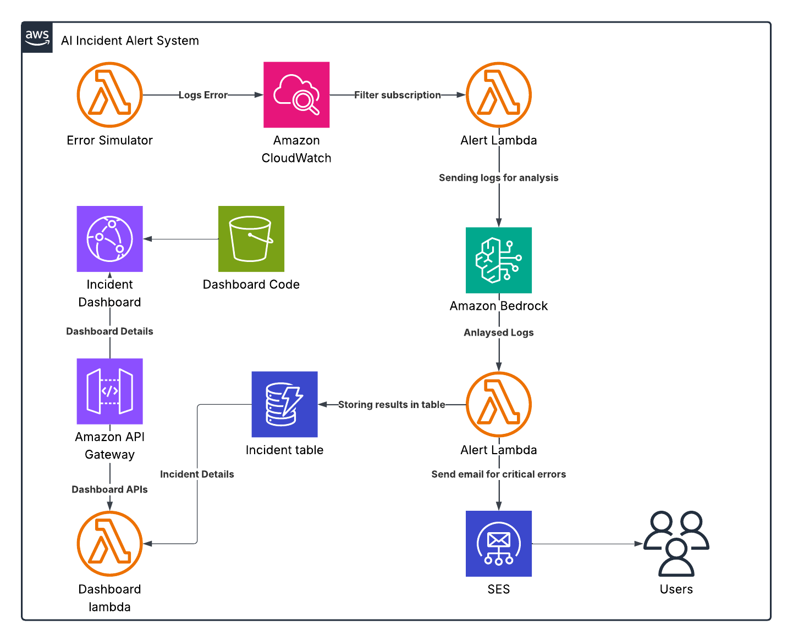

# AI-Incident-Alert-System

A smart incident alerting system that:

- Monitors metrics/logs/events.
- Uses AI/ML to reduce alert noise and prioritize critical issues.
- Sends alerts via Email.
- Improves over time using feedback and ML.

## Architecture Overview

## Main AWS Services Used:

- **CloudWatch** – For metrics/logs/events collection.
- **Lambda** – For AI-based processing & decision logic.
- **SES** – To send email notifications.
- **DynamoDB** – To store alerts and feedback.
- **Bedrock** – For ML/AI model (Claude Haiku model).
- **API Gateway** – For feedback & alert resolution APIs.
- **S3** - For storing fronend code.
- **Cloudfront** - For deploying dashboard application.

## **System Flow**

1. **Error Simulator Lamdba**: Generates error log
2. **CloudWatch Log** invokes **Alert Lambda** with error filter subscription.
3. **Lambda Function**:
   - Analyzes the alert by invoking a **Bedrock model** for severity classification
   - Stores the alert in **DynamoDB**
   - Sends prioritized alert via **SES**
4. A dashboard to view status of all issues.
   - Uses APIs from **API Gateway** which invoked **lambda**
   - **Lambda** fetches information from **DynamoDb Incidents Table**.

## Features

- **AI Severity Classification**: Use Bedrock pre-trained models to classify incident priority based on logs.
- **Auto Scaling**: Able to handle many requests due to Lambda in backend.
- **Storing results**: Store responses to DynamoDB Table.
- **Smart Error Classiifcation**: Automatically classifies errors to different severity like (Critical, High, Medium or Low).
- **Email Notifications**: Sends email notifications for critical issues to concerned persons.
- **Parallel Processing**: This is robust system which can handle parallel requests because of Lambda's auto scaling ability.

## Test Cases

- Dashbaord has Error simulation buttons for simulating some of the errors.
- Clicking on different issue buttons will simulate different issues.
- Once the issue is logged in cloudwatch it will be analysed by the Alert Lambda.
- We have successfullly tested for different types of error scenarios as given in the dashboard.

## Future Enhancements

- Slack integration for feedback (“Resolved”, “Noise”, “Critical”) to retrain model.
- Web dashboard to view active alerts & ML score.
- Auto-ticket creation in Jira/ServiceNow via Lambda.
- ML-based anomaly & severity classification
- AI-driven deduplication & grouping.
- Slack, SMS, Webhooks, team-based routing.
